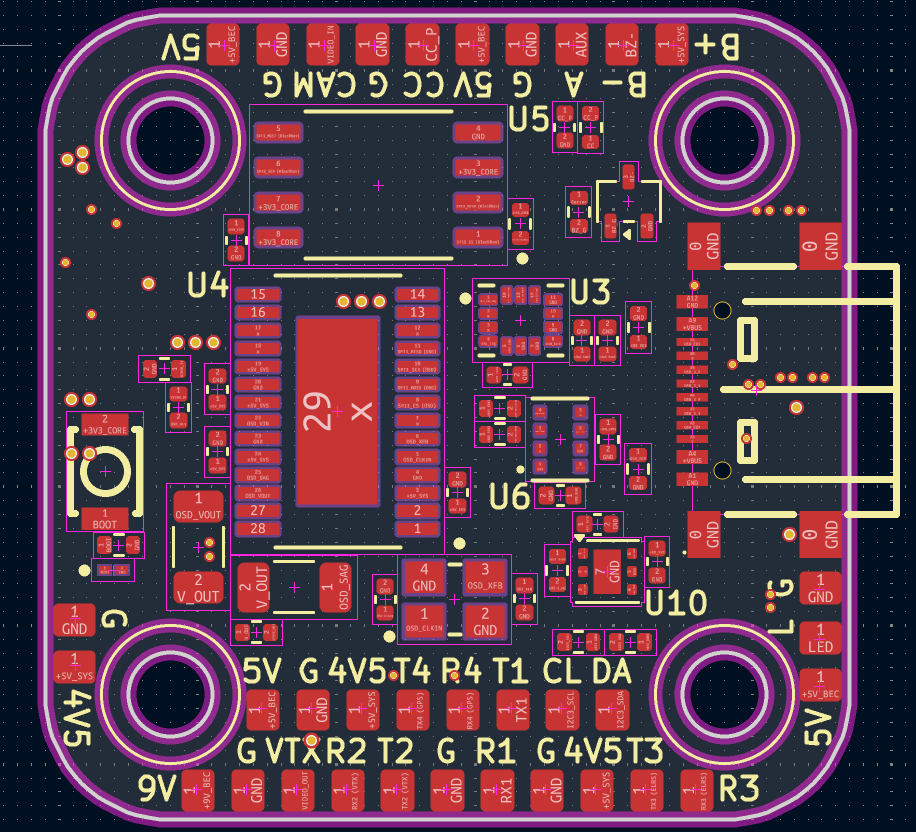
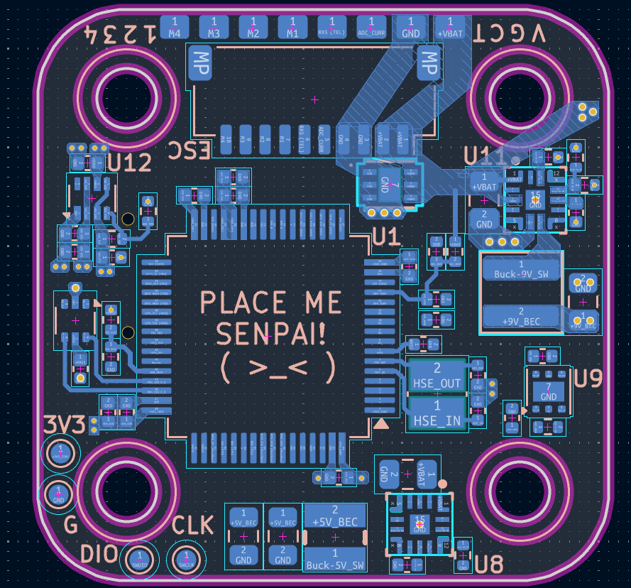

# smol-FC

**Work in progress.** This is a Betaflight-based flight controller project, currently in the hardware design phase. 
Everything can change, it's not a final product. 

## License
This project is licensed under the **CERN Open Hardware Licence v2 - Weakly Reciprocal (CERN-OHL-W-v2)**.
